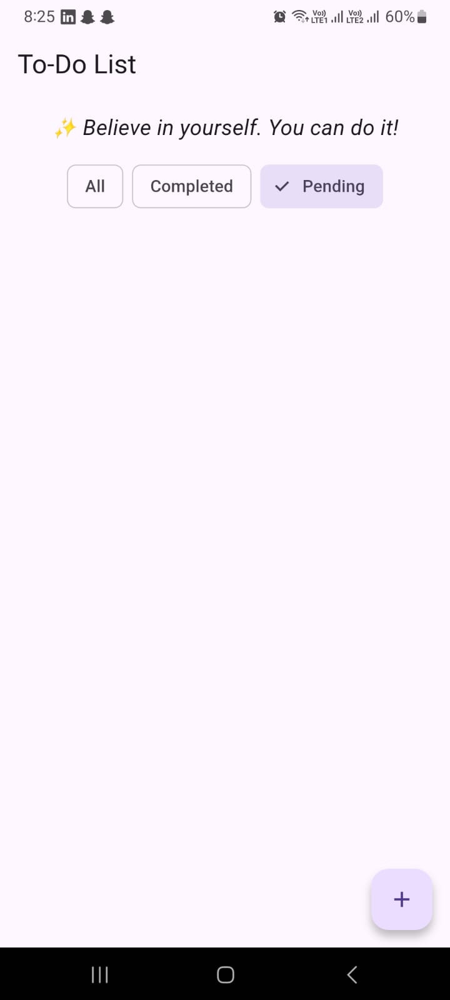
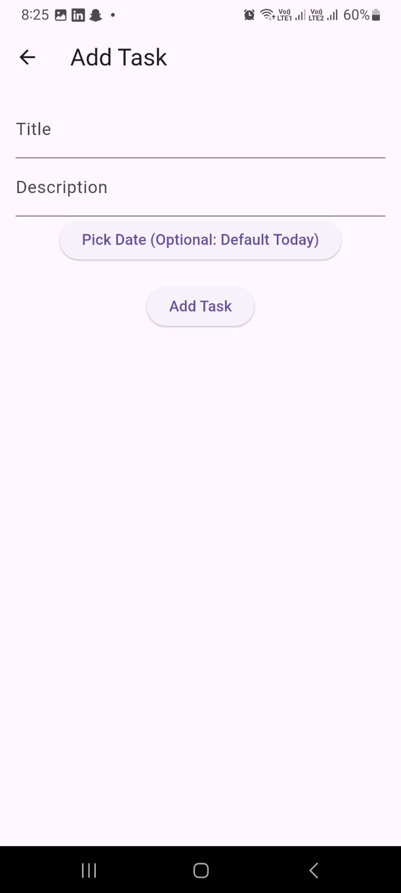
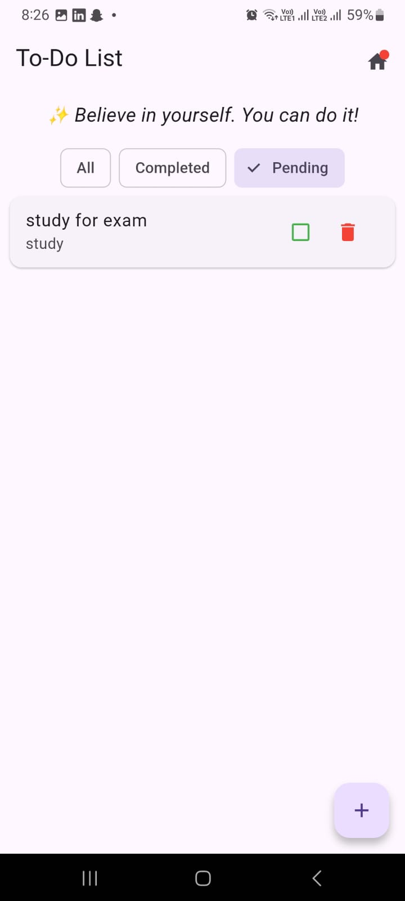
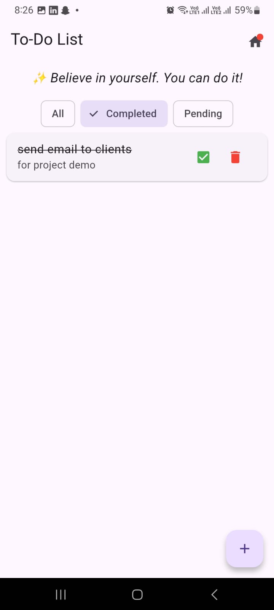
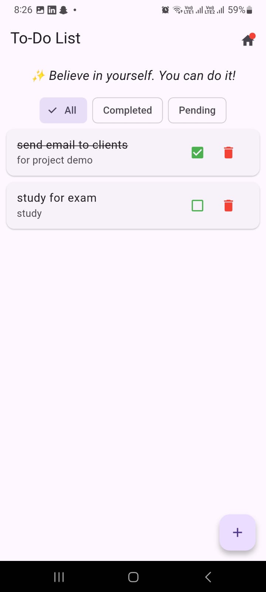

# ✅ Flutter To-Do App

A simple yet feature-rich To-Do List app built using **Flutter** and **Provider** for state management.

---

## 📱 Screenshots

> 💬 **Add your screenshots here after running the app!**

| Home Screen with Quote     | Add Task Screen           | Filter Tasks                 |
|----------------------------|---------------------------|------------------------------|
|  |  |  
|  

---

## 🚀 Features

### ✅ Basic

- Add new tasks with **title & description**
- View list of all tasks
- Mark tasks as **complete/incomplete**
- Delete tasks
- Uses **Provider** for state management
- **Responsive UI** (works on mobile & tablet)

### 🌟 Unique

- Shows a **daily motivational quote** at top of home screen
- Filter tasks: **All, Completed, Pending**
- Red **badge/dot** on home icon if there are tasks due today

---

## ⚡ How to Run

```bash
flutter pub get
flutter run
